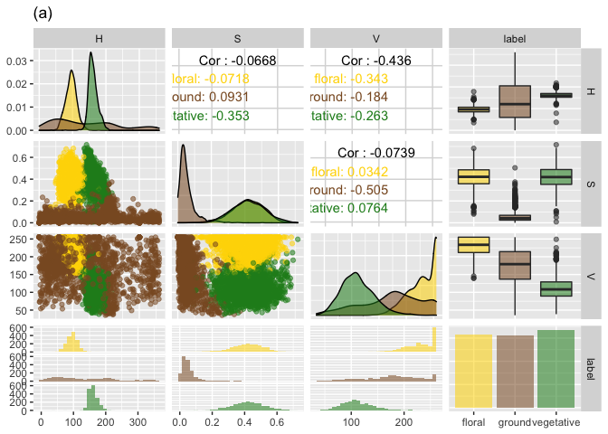
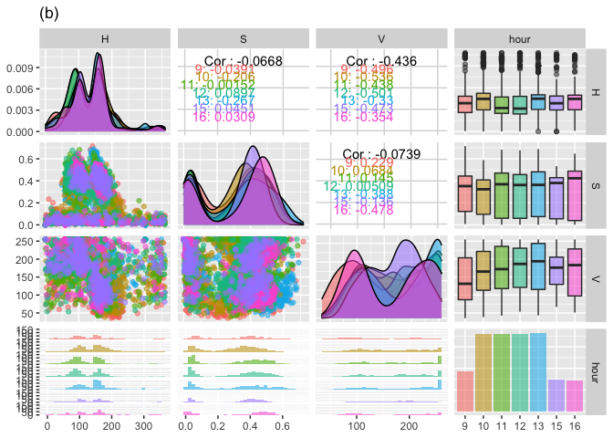
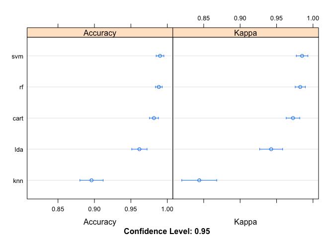

## Part I: Machine Learning Identification of Floral Pixels from drone images

### Introduction

Flower opening and closure are traits of reproductive importance in all angiosperms, because they determine the success of self- and cross-pollination events. Existing variations in floral opening hours have been recorded in many species, but the temporal nature of this phenotype has rendered it a difficult target for genetic studies. In this document, I describe a simple method using support vector machine (SVM) to identify flowers from image series obtained by a drone-based remote sensing phenotyping experiment. Floral pixels were identified from the images using a support vector machine (SVM) machine learning algorithm with an accuracy above 99%.    

### Load dataset.

You can find the dataset in this repository under FOH_GitHub_files/Labeled_pixel_samples.csv. The dataset consists of the Hue-Saturation-Value (HSV) readouts of sample floral, vegetative and ground pixels.  


```r
library(ggplot2)
library(GGally)
```

```
## Registered S3 method overwritten by 'GGally':
##   method from   
##   +.gg   ggplot2
```

```r
library(gridExtra)
allpix_plot = read.csv("/Users/rongkui/Desktop/Lab/Aim4_FloweringHour/FloralOpening/FOH_GitHub_files/Labeled_pixel_samples.csv")

allpix_pairs = allpix_plot[,c("H","S","V","label")]
allpix_hour = allpix_plot[,c("H","S","V","hour")]
allpix_hour$hour = as.factor(allpix_hour$hour)
```


There are 1569 floral pixels, 1681 vegetative pixels, and 1557 ground pixels. The HSV distribution of the pixels of different categories looks like:


```r
p = ggpairs(allpix_pairs, aes(colour = label, alpha = 0.4), title = "(a)")
for(i in 1:p$nrow) {
  for(j in 1:p$ncol){
    p[i,j] <- p[i,j] + 
        scale_fill_manual(values=c("gold", "tan4", "forestgreen")) +
        scale_color_manual(values=c("gold", "tan4", "forestgreen"))  
  }
}
p
```

```
## `stat_bin()` using `bins = 30`. Pick better value with `binwidth`.
## `stat_bin()` using `bins = 30`. Pick better value with `binwidth`.
## `stat_bin()` using `bins = 30`. Pick better value with `binwidth`.
```

<!-- -->

These samples were taken from seven separate images, each represent one time point of the day (9 am, 10 am, 11 am, 12 am, 1 pm, 3 pm and 4pm).


```r
ggpairs(allpix_hour, aes(colour = hour, alpha = 0.4), title = "(b)")
```

```
## `stat_bin()` using `bins = 30`. Pick better value with `binwidth`.
## `stat_bin()` using `bins = 30`. Pick better value with `binwidth`.
## `stat_bin()` using `bins = 30`. Pick better value with `binwidth`.
```

<!-- -->

### Put things in perspective: human learning     

At a first step, I'd like to show how this task is difficult for conventional/naive classification methods. As an example, I am showing the result of a hard thresholding method. Looking at the distribution along the H-S-V axes of the floral pixels, I am classifying all pixels that fall within the [0.01, 0.99] range of these distributions to be "floral".   


```r
floralpix = allpix_plot[allpix_plot$label == 'floral',]
filtered_pix = allpix_plot[allpix_plot$H > quantile(floralpix$H, 0.01) & allpix_plot$H < quantile(floralpix$H, 0.99) & allpix_plot$S > quantile(floralpix$S, 0.01) & allpix_plot$S < quantile(floralpix$S, 0.99) & allpix_plot$V > quantile(floralpix$V, 0.01) & allpix_plot$V < quantile(floralpix$V, 0.99),]
dim(filtered_pix)
```

```
## [1] 1201   10
```

```r
table(filtered_pix$label == "floral")[2]
```

```
## TRUE 
## 1195
```


```r
dim(floralpix)
```

```
## [1] 1569   10
```

```r
table(filtered_pix$label == "floral")[2]/(dim(floralpix)[1])
```

```
##      TRUE 
## 0.7616316
```

```r
table(filtered_pix$label == "floral")[1]/(dim(floralpix)[1]) #0.003 false positive
```

```
##       FALSE 
## 0.003824092
```

**We can see that although the false positive rate is really low, the false negative rate is as high as 24%. This can pose a big problem when the signal is weak. **

### The real deal: Machine learning methods

There are five machine learning methods we would like to test for our dataset: linear discrimination analysis (LDA), classification and regression tree (CART), K nearest neighbor (KNN), support vector machine (SVM), and random forest (RF).   


```r
library(caret)
```

```
## Loading required package: lattice
```

```r
selected = sample(1:nrow(allpix_plot), ceiling(nrow(allpix_plot)/2))
training = allpix_plot[selected,which(colnames(allpix_plot) == 'H') : which(colnames(allpix_plot) == 'label')]
training$label = as.factor(training$label)
table(training$label)
```

```
## 
##     floral     ground vegetative 
##        797        782        825
```

```r
validation = allpix_plot[-selected,which(colnames(allpix_plot) == 'H') : which(colnames(allpix_plot) == 'label')]
validation$label = as.factor(validation$label)
control <- trainControl(method="cv", number=10)
metric <- "Accuracy"
fit.lda <- train(label~., data=training, method="lda", metric=metric, trControl=control)
fit.cart <- train(label~., data=training, method="rpart", metric=metric, trControl=control)
fit.knn <- train(label~., data=training, method="knn", metric=metric, trControl=control)
fit.svm <- train(label~., data=training, method="svmRadial", metric=metric, trControl=control)
fit.rf <- train(label~., data=training, method="rf", metric=metric, trControl=control)
```

```
## note: only 2 unique complexity parameters in default grid. Truncating the grid to 2 .
```

#### Compare results from different ML models


```r
results <- resamples(list(lda=fit.lda, cart=fit.cart, knn=fit.knn, svm=fit.svm, rf=fit.rf))
summary(results)
```

```
## 
## Call:
## summary.resamples(object = results)
## 
## Models: lda, cart, knn, svm, rf 
## Number of resamples: 10 
## 
## Accuracy 
##           Min.   1st Qu.    Median      Mean   3rd Qu.      Max. NA's
## lda  0.9375000 0.9513516 0.9583333 0.9617286 0.9770482 0.9793388    0
## cart 0.9666667 0.9792531 0.9813361 0.9816942 0.9875000 0.9958333    0
## knn  0.8583333 0.8848548 0.8962656 0.8960232 0.9032287 0.9375000    0
## svm  0.9750000 0.9874737 0.9896437 0.9900189 0.9958290 1.0000000    0
## rf   0.9791667 0.9833506 0.9875259 0.9883489 0.9916926 1.0000000    0
## 
## Kappa 
##           Min.   1st Qu.    Median      Mean   3rd Qu.      Max. NA's
## lda  0.9062109 0.9270192 0.9374853 0.9425791 0.9655644 0.9690069    0
## cart 0.9499961 0.9688693 0.9719978 0.9725346 0.9812485 0.9937485    0
## knn  0.7871786 0.8271489 0.8442750 0.8438863 0.8546883 0.9061449    0
## svm  0.9624863 0.9812066 0.9844618 0.9850243 0.9937425 1.0000000    0
## rf   0.9687451 0.9750223 0.9812829 0.9825196 0.9875337 1.0000000    0
```

```r
dotplot(results)
```

<!-- -->

> svm outperforms everybody else. RF is a close seconod. 

#### Plotting confusion matrix for svm:      

```r
selected = sample(1:nrow(allpix_plot), ceiling(nrow(allpix_plot)/2))
training = allpix_plot[selected,which(colnames(allpix_plot) == 'H') : which(colnames(allpix_plot) == 'label')]
training$label = as.factor(training$label)
fit.svm = train(label~., data=training, method="svmRadial", metric=metric, trControl=control)
testing = allpix_plot[-selected,which(colnames(allpix_plot) == 'H') : which(colnames(allpix_plot) == 'label')]
testing$label = as.character(testing$label)
predictions <- predict(fit.svm, testing)
testing$label = as.factor(testing$label)
levels(testing$label)
```

```
## [1] "floral"     "ground"     "vegetative"
```

```r
confusionMatrix(predictions, testing$label)
```

```
## Confusion Matrix and Statistics
## 
##             Reference
## Prediction   floral ground vegetative
##   floral        774      1          5
##   ground          3    792          3
##   vegetative      4      9        812
## 
## Overall Statistics
##                                           
##                Accuracy : 0.9896          
##                  95% CI : (0.9847, 0.9933)
##     No Information Rate : 0.3412          
##     P-Value [Acc > NIR] : <2e-16          
##                                           
##                   Kappa : 0.9844          
##                                           
##  Mcnemar's Test P-Value : 0.2497          
## 
## Statistics by Class:
## 
##                      Class: floral Class: ground Class: vegetative
## Sensitivity                 0.9910        0.9875            0.9902
## Specificity                 0.9963        0.9963            0.9918
## Pos Pred Value              0.9923        0.9925            0.9842
## Neg Pred Value              0.9957        0.9938            0.9949
## Prevalence                  0.3250        0.3337            0.3412
## Detection Rate              0.3221        0.3296            0.3379
## Detection Prevalence        0.3246        0.3321            0.3433
## Balanced Accuracy           0.9937        0.9919            0.9910
```

```r
dim(testing)
```

```
## [1] 2403    4
```

#### Confusion matrix to QC results from svm ML method      


```r
predictions <- predict(fit.svm, validation)
confusionMatrix(predictions, validation$label)
```

```
## Confusion Matrix and Statistics
## 
##             Reference
## Prediction   floral ground vegetative
##   floral        764      1          3
##   ground          4    766          4
##   vegetative      4      8        849
## 
## Overall Statistics
##                                           
##                Accuracy : 0.99            
##                  95% CI : (0.9852, 0.9936)
##     No Information Rate : 0.3562          
##     P-Value [Acc > NIR] : <2e-16          
##                                           
##                   Kappa : 0.985           
##                                           
##  Mcnemar's Test P-Value : 0.351           
## 
## Statistics by Class:
## 
##                      Class: floral Class: ground Class: vegetative
## Sensitivity                 0.9896        0.9884            0.9918
## Specificity                 0.9975        0.9951            0.9922
## Pos Pred Value              0.9948        0.9897            0.9861
## Neg Pred Value              0.9951        0.9945            0.9955
## Prevalence                  0.3213        0.3225            0.3562
## Detection Rate              0.3179        0.3188            0.3533
## Detection Prevalence        0.3196        0.3221            0.3583
## Balanced Accuracy           0.9936        0.9917            0.9920
```

> The result looks really good! But let's not get excited too early. There are a few measures we can take to evaluate how reproducible our excellent result is.   

### Test robustness of model

Permutating training set to test robustness of model. What if we just got lucky with the first randomly chosen training dataset?   


```r
library(caret)

confusion_matrices_svm = as.data.frame(matrix(0, nrow = 10, ncol = 7))
confusion_matrices_rf = as.data.frame(matrix(0, nrow = 10, ncol = 7))
control <- trainControl(method="cv", number=10)
metric <- "Accuracy"

for (i in 1:10) {
  set.seed(i)
  selected = sample(1:nrow(allpix_plot), ceiling(nrow(allpix_plot)/2))
  training = allpix_plot[selected,which(colnames(allpix_plot) == 'H') : which(colnames(allpix_plot) == 'label')]
  training$label = as.factor(training$label)
  table(training$label)
  validation = allpix_plot[-selected,which(colnames(allpix_plot) == 'H') : which(colnames(allpix_plot) == 'label')]
  validation$label = as.factor(validation$label)

  fit.svm <- train(label~., data=training, method="svmRadial", metric=metric, trControl=control)
  fit.rf <- train(label~., data=training, method="rf", metric=metric, trControl=control)
#results <- resamples(list(lda=fit.lda, cart=fit.cart, knn=fit.knn, svm=fit.svm, rf=fit.rf))
#summary(results)
#dotplot(results)
  predictions_svm <- predict(fit.svm, validation)
  conf.mat_svm = confusionMatrix(predictions_svm, validation$label)
  confusion_matrices_svm[i,] = conf.mat_svm$overall

  predictions_rf <- predict(fit.rf, validation)
  conf.mat_rf = confusionMatrix(predictions_rf, validation$label)
  confusion_matrices_rf[i,] = conf.mat_rf$overall
}
```

```
## note: only 2 unique complexity parameters in default grid. Truncating the grid to 2 .
## 
## note: only 2 unique complexity parameters in default grid. Truncating the grid to 2 .
## 
## note: only 2 unique complexity parameters in default grid. Truncating the grid to 2 .
## 
## note: only 2 unique complexity parameters in default grid. Truncating the grid to 2 .
## 
## note: only 2 unique complexity parameters in default grid. Truncating the grid to 2 .
## 
## note: only 2 unique complexity parameters in default grid. Truncating the grid to 2 .
## 
## note: only 2 unique complexity parameters in default grid. Truncating the grid to 2 .
## 
## note: only 2 unique complexity parameters in default grid. Truncating the grid to 2 .
## 
## note: only 2 unique complexity parameters in default grid. Truncating the grid to 2 .
## 
## note: only 2 unique complexity parameters in default grid. Truncating the grid to 2 .
```

```r
summary(confusion_matrices_svm$V1)
```

```
##    Min. 1st Qu.  Median    Mean 3rd Qu.    Max. 
##  0.9879  0.9886  0.9896  0.9897  0.9909  0.9917
```

```r
summary(confusion_matrices_rf$V1)
```

```
##    Min. 1st Qu.  Median    Mean 3rd Qu.    Max. 
##  0.9813  0.9842  0.9856  0.9855  0.9867  0.9896
```

**Both the SVM model and the RF model are robust against different randomizations. **

#### Saturation process:    

What sized training set do you need to achieve 95% accuracy?     

```r
sat_curve_svm2 = as.data.frame(matrix(0, nrow = 7, ncol = 7))
colnames(sat_curve_svm2) = c("Accuracy","Kappa","AccuracyLower","AccuracyUpper","AccuracyNull","AccuracyPValue","McnemarPValue")
control <- trainControl(method="cv", number=10)
metric <- "Accuracy"

n = 1
for (i in c(300, 500, 1000, 1500, 2000, 2500, 3000)) {
  selected = sample(1:nrow(allpix_plot), i)
  training = allpix_plot[selected,7:10]
  training$label = as.factor(training$label)
  table(training$label)
  validation = allpix_plot[allpix_plot$hour == 15,7:10]
  validation$label = as.factor(validation$label)
  table(validation$label)

  fit.svm <- train(label~., data=training, method="svmRadial", metric=metric, trControl=control)

  predictions_svm <- predict(fit.svm, validation)
  conf.mat_svm = confusionMatrix(predictions_svm, validation$label)
  sat_curve_svm2[n,] = conf.mat_svm$overall
  n = n+1
}

sat_curve_svm2 
```

```
##    Accuracy     Kappa AccuracyLower AccuracyUpper AccuracyNull AccuracyPValue
## 1 0.9647696 0.9470968     0.9405085     0.9811104    0.3495935  3.738787e-142
## 2 0.9783198 0.9674829     0.9577298     0.9905946    0.3495935  4.310604e-151
## 3 0.9810298 0.9715306     0.9613063     0.9923398    0.3495935  5.112513e-153
## 4 0.9837398 0.9756025     0.9649461     0.9940100    0.3495935  5.291093e-155
## 5 0.9864499 0.9796708     0.9686634     0.9955861    0.3495935  4.680792e-157
## 6 0.9837398 0.9755928     0.9649461     0.9940100    0.3495935  5.291093e-155
## 7 0.9837398 0.9756025     0.9649461     0.9940100    0.3495935  5.291093e-155
##   McnemarPValue
## 1           NaN
## 2           NaN
## 3           NaN
## 4           NaN
## 5           NaN
## 6           NaN
## 7           NaN
```

**Column 1, "Accuracy" is what we are most interested in. It turns out that the different pixel classes in our dataset are so clearly distinguishable from each other tahat even with only 150 data points input we can get really good prediction accuracy. Pleasant surprise!**     

#### Final version: use svm + entire dataset (training + testing) to build the model


```r
control <- trainControl(method="cv", number=10)
metric <- "Accuracy"
fit.svm_whole <- train(label~., data=allpix_plot[,which(colnames(allpix_plot) == 'H') : which(colnames(allpix_plot) == 'label')], method="svmRadial", metric=metric, trControl=control)
fit.svm_whole$results
```

```
##       sigma    C  Accuracy     Kappa  AccuracySD     KappaSD
## 1 0.9800399 0.25 0.9893871 0.9840697 0.004103250 0.006159771
## 2 0.9800399 0.50 0.9895967 0.9843850 0.004161410 0.006246250
## 3 0.9800399 1.00 0.9902209 0.9853221 0.003806662 0.005713412
```

#### Deploy your model! 

Now we can feed whole images into our machine learning model for prediction. You might want to run this on a super computer that you have access to. In my case, each of my field images contained more than 70 million pixels, and my little laptop obviously wasn't going to be able to handle it. I submitted my job onto a single core and the job finished running overnight. The spatial images used here will be made available on a public repository soon. I will update the information here as soon as the upload completes. 


```r
library(data.table)
library(tidyverse)
library(raster)
library(caret)
library(kernlab)
load("SVM_model.RData")
files = list.files(path = "/share/rwmwork/rongkui/Drone/Results", pattern = "Lettuce_Multi_201907\\S+[H|S|V|E|N]\\.csv")
file_groups = unique(substr(files, 1, 27))
file_groups 
rasters = list()
large_collection = list()
another_large_collection = list()

for (i in file_groups[-1]) {
  time = substr(i, 24, 27)
  fileH = fread(paste(i, "_H.csv", sep = ""))
  colnames(fileH) = as.character(1:ncol(fileH))
  rownames(fileH) = as.character(1:nrow(fileH))
  fileH = as.data.frame(fileH)
  fileH['row'] = rownames(fileH)
  tidyH = fileH %>%
    gather(`1`:(ncol(fileH)-1), key = column, value = H)
  
  fileS = fread(paste(i, "_S.csv", sep = ""))
  colnames(fileS) = as.character(1:ncol(fileS))
  rownames(fileS) = as.character(1:nrow(fileS))
  tidyS = fileS %>%
    gather(`1`:ncol(fileS), key = column, value = S)
  
  fileV = fread(paste(i, "_V.csv", sep = ""))
  colnames(fileV) = as.character(1:ncol(fileV))
  rownames(fileV) = as.character(1:nrow(fileV))
  tidyV = fileV %>%
    gather(`1`:ncol(fileV), key = column, value = V)
  
  collection = as.data.frame(cbind(tidyH, tidyS['S'], tidyV['V']))
  names(collection) = c("row","column","H","S","V")
  collection2 = collection
  
  collection2['pred_label'] = predict(fit.svm_whole, collection)
  collection2['quant'] = 0
  collection2$quant[collection2$pred_label == 'flower'] = 255
  collection3 = collection2[,c("row","column","quant")]
  collection3$row = as.numeric(collection3$row)
  collection3$column = as.numeric(collection3$column)
  
  large_collection[[i]] = collection2
  another_large_collection[[i]] = collection3
  write.csv(collection2, file = paste(i, "floral_pred_res_long.csv", sep = ""))
  write.csv(collection3, file = paste(i, "floral_pred_res_grid.csv", sep = ""))
}
```
