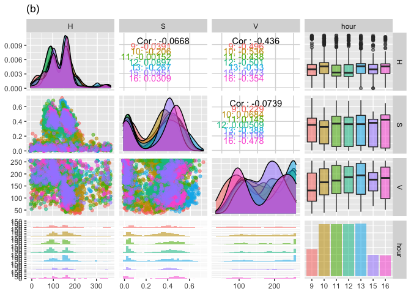
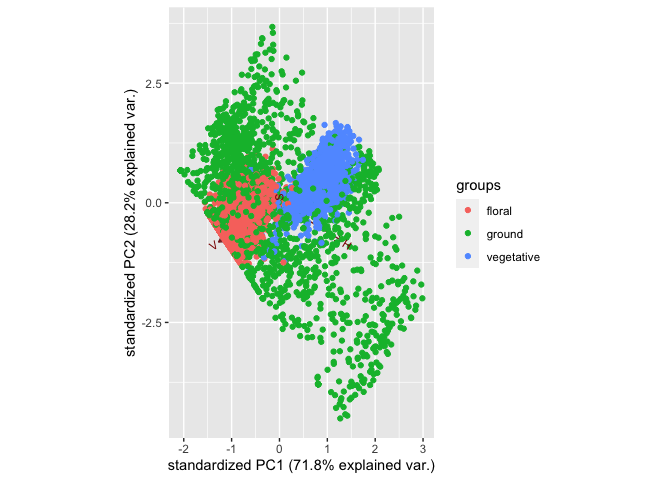
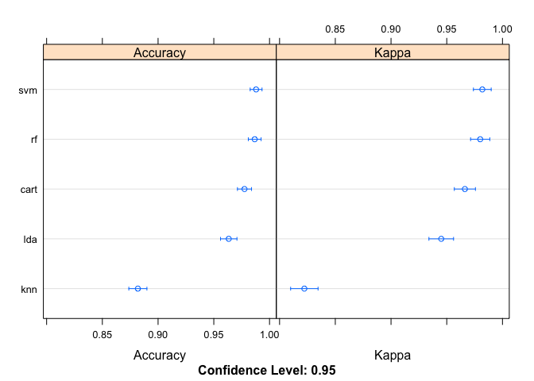

### Load dataset.

You can find the dataset in the repository

```r
library(ggplot2)
library(GGally)
```

```
## Registered S3 method overwritten by 'GGally':
##   method from   
##   +.gg   ggplot2
```

```r
library(gridExtra)
allpix_plot = read.csv("/Users/rongkui/Desktop/Lab/Aim4_FloweringHour/Results/Labeled_pixel_samples.csv")

allpix_pairs = allpix_plot[,c("H","S","V","label")]
allpix_hour = allpix_plot[,c("H","S","V","hour")]
allpix_hour$hour = as.factor(allpix_hour$hour)

ggpairs(allpix_pairs, aes(colour = label, alpha = 0.4), title = "(a)")
```

```
## `stat_bin()` using `bins = 30`. Pick better value with `binwidth`.
```

```
## `stat_bin()` using `bins = 30`. Pick better value with `binwidth`.
## `stat_bin()` using `bins = 30`. Pick better value with `binwidth`.
```

<!-- -->

```r
ggpairs(allpix_hour, aes(colour = hour, alpha = 0.4), title = "(b)")
```

```
## `stat_bin()` using `bins = 30`. Pick better value with `binwidth`.
## `stat_bin()` using `bins = 30`. Pick better value with `binwidth`.
## `stat_bin()` using `bins = 30`. Pick better value with `binwidth`.
```

<!-- -->

```r
table(allpix_plot$label, allpix_plot$hour)
```

```
##             
##                9  10  11  12  13  15  16
##   floral     151 300 306 300 300 120  92
##   ground     162 284 301 284 282 120 124
##   vegetative 149 316 295 316 332 129 144
```

```r
table(allpix_plot$label)
```

```
## 
##     floral     ground vegetative 
##       1569       1557       1681
```

### PCA


```r
allpca = prcomp(allpix_plot[,which(colnames(allpix_plot) == 'H') : which(colnames(allpix_plot) == 'V')])
library(ggbiplot)
```

```
## Loading required package: plyr
```

```
## Loading required package: scales
```

```
## Loading required package: grid
```

```r
ggbiplot(allpca, group = as.factor(allpix_plot$label))
```

<!-- -->


```r
ggbiplot(allpca, 2:3, group = as.factor(allpix_plot$label))
```

<!-- -->

### Put things in perspective: human learning     

At a first step, I'd like to show how this task is difficult for conventional/naive classification methods. As an example, I am showing the result of a hard thresholding method. Looking at the distribution along the H-S-V axes of the floral pixels, I am classifying all pixels that fall within the [0.01, 0.99] range of these distributions to be "floral".   


```r
floralpix = allpix_plot[allpix_plot$label == 'floral',]
filtered_pix = allpix_plot[allpix_plot$H > quantile(floralpix$H, 0.01) & allpix_plot$H < quantile(floralpix$H, 0.99) & allpix_plot$S > quantile(floralpix$S, 0.01) & allpix_plot$S < quantile(floralpix$S, 0.99) & allpix_plot$V > quantile(floralpix$V, 0.01) & allpix_plot$V < quantile(floralpix$V, 0.99),]
dim(filtered_pix)
```

```
## [1] 1201   11
```

```r
table(filtered_pix$label == "floral")[2]
```

```
## TRUE 
## 1195
```


```r
dim(floralpix)
```

```
## [1] 1569   11
```

```r
table(filtered_pix$label == "floral")[2]/(dim(floralpix)[1])
```

```
##      TRUE 
## 0.7616316
```

```r
table(filtered_pix$label == "floral")[1]/(dim(floralpix)[1]) #0.003 false positive
```

```
##       FALSE 
## 0.003824092
```

> We can see that also the false positive rate is really low, the false negative rate  is as high as 24%. This can pose a big problem when the signal is weak. 

### The real deal: Machine learning methods

There are five machine learning methods we would like to test for our dataset: linear discrimination analysis (LDA), classification and regression tree (CART), K nearest neighbor (KNN), support vector machine (SVM), and random forest (RF).   


```r
library(caret)
```

```
## Loading required package: lattice
```

```r
selected = sample(1:nrow(allpix_plot), ceiling(nrow(allpix_plot)/2))
training = allpix_plot[selected,which(colnames(allpix_plot) == 'H') : which(colnames(allpix_plot) == 'label')]
training$label = as.factor(training$label)
table(training$label)
```

```
## 
##     floral     ground vegetative 
##        782        763        859
```

```r
validation = allpix_plot[-selected,which(colnames(allpix_plot) == 'H') : which(colnames(allpix_plot) == 'label')]
validation$label = as.factor(validation$label)
control <- trainControl(method="cv", number=10)
metric <- "Accuracy"
fit.lda <- train(label~., data=training, method="lda", metric=metric, trControl=control)
fit.cart <- train(label~., data=training, method="rpart", metric=metric, trControl=control)
fit.knn <- train(label~., data=training, method="knn", metric=metric, trControl=control)
fit.svm <- train(label~., data=training, method="svmRadial", metric=metric, trControl=control)
fit.rf <- train(label~., data=training, method="rf", metric=metric, trControl=control)
```

```
## note: only 2 unique complexity parameters in default grid. Truncating the grid to 2 .
```

#### Compare results from different ML models


```r
results <- resamples(list(lda=fit.lda, cart=fit.cart, knn=fit.knn, svm=fit.svm, rf=fit.rf))
summary(results)
```

```
## 
## Call:
## summary.resamples(object = results)
## 
## Models: lda, cart, knn, svm, rf 
## Number of resamples: 10 
## 
## Accuracy 
##           Min.   1st Qu.    Median      Mean   3rd Qu.      Max. NA's
## lda  0.9456067 0.9594139 0.9667445 0.9650395 0.9708333 0.9752066    0
## cart 0.9625000 0.9760417 0.9792099 0.9792012 0.9854383 0.9917012    0
## knn  0.8708333 0.8844917 0.8979167 0.8968461 0.9047607 0.9333333    0
## svm  0.9751037 0.9833506 0.9875259 0.9875346 0.9916926 1.0000000    0
## rf   0.9708333 0.9843750 0.9875519 0.9858593 0.9906380 0.9958333    0
## 
## Kappa 
##           Min.   1st Qu.    Median      Mean   3rd Qu.      Max. NA's
## lda  0.9183529 0.9390984 0.9500435 0.9475042 0.9561970 0.9627520    0
## cart 0.9436943 0.9640143 0.9687652 0.9687580 0.9781262 0.9875365    0
## knn  0.8057644 0.8262621 0.8463544 0.8448278 0.8568047 0.8997180    0
## svm  0.9625757 0.9749833 0.9812669 0.9812735 0.9875259 1.0000000    0
## rf   0.9561747 0.9765082 0.9813045 0.9787601 0.9859395 0.9937422    0
```

```r
dotplot(results)
```

<!-- -->

> svm outperforms everybody else. RF is a close seconod. 

#### Plotting confusion matrix for svm:      

```r
selected = sample(1:nrow(allpix_plot), ceiling(nrow(allpix_plot)/2))
training = allpix_plot[selected,which(colnames(allpix_plot) == 'H') : which(colnames(allpix_plot) == 'label')]
training$label = as.factor(training$label)
fit.svm = train(label~., data=training, method="svmRadial", metric=metric, trControl=control)
testing = allpix_plot[-selected,which(colnames(allpix_plot) == 'H') : which(colnames(allpix_plot) == 'label')]
testing$label = as.character(testing$label)
predictions <- predict(fit.svm, testing)
testing$label = as.factor(testing$label)
levels(testing$label)
```

```
## [1] "floral"     "ground"     "vegetative"
```

```r
confusionMatrix(predictions, testing$label)
```

```
## Confusion Matrix and Statistics
## 
##             Reference
## Prediction   floral ground vegetative
##   floral        761      2          1
##   ground          7    773          6
##   vegetative     10      4        839
## 
## Overall Statistics
##                                           
##                Accuracy : 0.9875          
##                  95% CI : (0.9822, 0.9916)
##     No Information Rate : 0.3521          
##     P-Value [Acc > NIR] : < 2e-16         
##                                           
##                   Kappa : 0.9813          
##                                           
##  Mcnemar's Test P-Value : 0.01448         
## 
## Statistics by Class:
## 
##                      Class: floral Class: ground Class: vegetative
## Sensitivity                 0.9781        0.9923            0.9917
## Specificity                 0.9982        0.9920            0.9910
## Pos Pred Value              0.9961        0.9835            0.9836
## Neg Pred Value              0.9896        0.9963            0.9955
## Prevalence                  0.3238        0.3242            0.3521
## Detection Rate              0.3167        0.3217            0.3491
## Detection Prevalence        0.3179        0.3271            0.3550
## Balanced Accuracy           0.9882        0.9921            0.9914
```

```r
dim(testing)
```

```
## [1] 2403    4
```

#### Confusion matrix to QC results from svm ML method      


```r
predictions <- predict(fit.svm, validation)
confusionMatrix(predictions, validation$label)
```

```
## Confusion Matrix and Statistics
## 
##             Reference
## Prediction   floral ground vegetative
##   floral        776      1          1
##   ground          6    788          3
##   vegetative      5      5        818
## 
## Overall Statistics
##                                           
##                Accuracy : 0.9913          
##                  95% CI : (0.9867, 0.9946)
##     No Information Rate : 0.3421          
##     P-Value [Acc > NIR] : < 2e-16         
##                                           
##                   Kappa : 0.9869          
##                                           
##  Mcnemar's Test P-Value : 0.08073         
## 
## Statistics by Class:
## 
##                      Class: floral Class: ground Class: vegetative
## Sensitivity                 0.9860        0.9924            0.9951
## Specificity                 0.9988        0.9944            0.9937
## Pos Pred Value              0.9974        0.9887            0.9879
## Neg Pred Value              0.9932        0.9963            0.9975
## Prevalence                  0.3275        0.3304            0.3421
## Detection Rate              0.3229        0.3279            0.3404
## Detection Prevalence        0.3238        0.3317            0.3446
## Balanced Accuracy           0.9924        0.9934            0.9944
```

> The result looks really good! But let's not get excited too early. There are a few measures we can take to evaluate how reproducible our excellent result is.   

### Test robustness of model

Permutating training set to test robustness of model. What if we just got lucky with the first randomly chosen training dataset?   


```r
library(caret)

confusion_matrices_svm = as.data.frame(matrix(0, nrow = 10, ncol = 7))
confusion_matrices_rf = as.data.frame(matrix(0, nrow = 10, ncol = 7))
control <- trainControl(method="cv", number=10)
metric <- "Accuracy"

for (i in 1:10) {
  set.seed(i)
  selected = sample(1:nrow(allpix_plot), ceiling(nrow(allpix_plot)/2))
  training = allpix_plot[selected,which(colnames(allpix_plot) == 'H') : which(colnames(allpix_plot) == 'label')]
  training$label = as.factor(training$label)
  table(training$label)
  validation = allpix_plot[-selected,which(colnames(allpix_plot) == 'H') : which(colnames(allpix_plot) == 'label')]
  validation$label = as.factor(validation$label)

  fit.svm <- train(label~., data=training, method="svmRadial", metric=metric, trControl=control)
  fit.rf <- train(label~., data=training, method="rf", metric=metric, trControl=control)
#results <- resamples(list(lda=fit.lda, cart=fit.cart, knn=fit.knn, svm=fit.svm, rf=fit.rf))
#summary(results)
#dotplot(results)
  predictions_svm <- predict(fit.svm, validation)
  conf.mat_svm = confusionMatrix(predictions_svm, validation$label)
  confusion_matrices_svm[i,] = conf.mat_svm$overall

  predictions_rf <- predict(fit.rf, validation)
  conf.mat_rf = confusionMatrix(predictions_rf, validation$label)
  confusion_matrices_rf[i,] = conf.mat_rf$overall
}
```

```
## note: only 2 unique complexity parameters in default grid. Truncating the grid to 2 .
## 
## note: only 2 unique complexity parameters in default grid. Truncating the grid to 2 .
## 
## note: only 2 unique complexity parameters in default grid. Truncating the grid to 2 .
## 
## note: only 2 unique complexity parameters in default grid. Truncating the grid to 2 .
## 
## note: only 2 unique complexity parameters in default grid. Truncating the grid to 2 .
## 
## note: only 2 unique complexity parameters in default grid. Truncating the grid to 2 .
## 
## note: only 2 unique complexity parameters in default grid. Truncating the grid to 2 .
## 
## note: only 2 unique complexity parameters in default grid. Truncating the grid to 2 .
## 
## note: only 2 unique complexity parameters in default grid. Truncating the grid to 2 .
## 
## note: only 2 unique complexity parameters in default grid. Truncating the grid to 2 .
```

```r
summary(confusion_matrices_svm$V1)
```

```
##    Min. 1st Qu.  Median    Mean 3rd Qu.    Max. 
##  0.9879  0.9886  0.9896  0.9897  0.9909  0.9917
```

```r
summary(confusion_matrices_rf$V1)
```

```
##    Min. 1st Qu.  Median    Mean 3rd Qu.    Max. 
##  0.9813  0.9842  0.9856  0.9855  0.9867  0.9896
```

#### Saturation curve:    

What sized training set do you need to achieve 95% accuracy?     

```r
sat_curve_svm2 = as.data.frame(matrix(0, nrow = 7, ncol = 7))
control <- trainControl(method="cv", number=10)
metric <- "Accuracy"

n = 1
for (i in c(300, 500, 1000, 1500, 2000, 2500, 3000)) {
  selected = sample(1:nrow(allpix_plot), i)
  training = allpix_plot[selected,7:10]
  training$label = as.factor(training$label)
  table(training$label)
  validation = allpix_plot[allpix_plot$hour == 15,7:10]
  validation$label = as.factor(validation$label)
  table(validation$label)

  fit.svm <- train(label~., data=training, method="svmRadial", metric=metric, trControl=control)

  predictions_svm <- predict(fit.svm, validation)
  conf.mat_svm = confusionMatrix(predictions_svm, validation$label)
  sat_curve_svm2[n,] = conf.mat_svm$overall
  n = n+1
}

sat_curve_svm2 
```

```
##          V1        V2        V3        V4        V5            V6  V7
## 1 0.9647696 0.9470968 0.9405085 0.9811104 0.3495935 3.738787e-142 NaN
## 2 0.9783198 0.9674829 0.9577298 0.9905946 0.3495935 4.310604e-151 NaN
## 3 0.9810298 0.9715306 0.9613063 0.9923398 0.3495935 5.112513e-153 NaN
## 4 0.9837398 0.9756025 0.9649461 0.9940100 0.3495935 5.291093e-155 NaN
## 5 0.9864499 0.9796708 0.9686634 0.9955861 0.3495935 4.680792e-157 NaN
## 6 0.9837398 0.9755928 0.9649461 0.9940100 0.3495935 5.291093e-155 NaN
## 7 0.9837398 0.9756025 0.9649461 0.9940100 0.3495935 5.291093e-155 NaN
```

> It turns out that the different pixel classes in our dataset are so clearly distinguishable from each other tahat even with only 150 data points input we can get really good prediction accuracy. Pleasant surprise!     

#### Final version: use svm + entire dataset (training + testing) to build the model


```r
control <- trainControl(method="cv", number=10)
metric <- "Accuracy"
fit.svm_whole <- train(label~., data=allpix_plot[,which(colnames(allpix_plot) == 'H') : which(colnames(allpix_plot) == 'label')], method="svmRadial", metric=metric, trControl=control)
fit.svm_whole$results
```

```
##       sigma    C  Accuracy     Kappa  AccuracySD     KappaSD
## 1 0.9800399 0.25 0.9893871 0.9840697 0.004103250 0.006159771
## 2 0.9800399 0.50 0.9895967 0.9843850 0.004161410 0.006246250
## 3 0.9800399 1.00 0.9902209 0.9853221 0.003806662 0.005713412
```


#### Deploy your model! 

Now we can feed whole images into our machine learning model for prediction. You might want to run this on a super computer that you have access to. I my case, each of my field images contained more than 70 million pixels, and my little laptop obviously wasn't going to be able to handle it. I submitted my job onto a single core and the job finished running overnight.  


```r
library(data.table)
library(tidyverse)
library(raster)
library(caret)
library(kernlab)
load("SVM_model.RData")
files = list.files(path = "/share/rwmwork/rongkui/Drone/Results", pattern = "Lettuce_Multi_201907\\S+[H|S|V|E|N]\\.csv")
file_groups = unique(substr(files, 1, 27))
file_groups 
rasters = list()
large_collection = list()
another_large_collection = list()

for (i in file_groups[-1]) {
  time = substr(i, 24, 27)
  fileH = fread(paste(i, "_H.csv", sep = ""))
  colnames(fileH) = as.character(1:ncol(fileH))
  rownames(fileH) = as.character(1:nrow(fileH))
  fileH = as.data.frame(fileH)
  fileH['row'] = rownames(fileH)
  tidyH = fileH %>%
    gather(`1`:(ncol(fileH)-1), key = column, value = H)
  
  fileS = fread(paste(i, "_S.csv", sep = ""))
  colnames(fileS) = as.character(1:ncol(fileS))
  rownames(fileS) = as.character(1:nrow(fileS))
  tidyS = fileS %>%
    gather(`1`:ncol(fileS), key = column, value = S)
  
  fileV = fread(paste(i, "_V.csv", sep = ""))
  colnames(fileV) = as.character(1:ncol(fileV))
  rownames(fileV) = as.character(1:nrow(fileV))
  tidyV = fileV %>%
    gather(`1`:ncol(fileV), key = column, value = V)
  
  collection = as.data.frame(cbind(tidyH, tidyS['S'], tidyV['V']))
  names(collection) = c("row","column","H","S","V")
  collection2 = collection
  
  collection2['pred_label'] = predict(fit.svm_whole, collection)
  collection2['quant'] = 0
  collection2$quant[collection2$pred_label == 'flower'] = 255
  collection3 = collection2[,c("row","column","quant")]
  collection3$row = as.numeric(collection3$row)
  collection3$column = as.numeric(collection3$column)
  
  large_collection[[i]] = collection2
  another_large_collection[[i]] = collection3
  write.csv(collection2, file = paste(i, "floral_pred_res_long.csv", sep = ""))
  write.csv(collection3, file = paste(i, "floral_pred_res_grid.csv", sep = ""))
}
```
